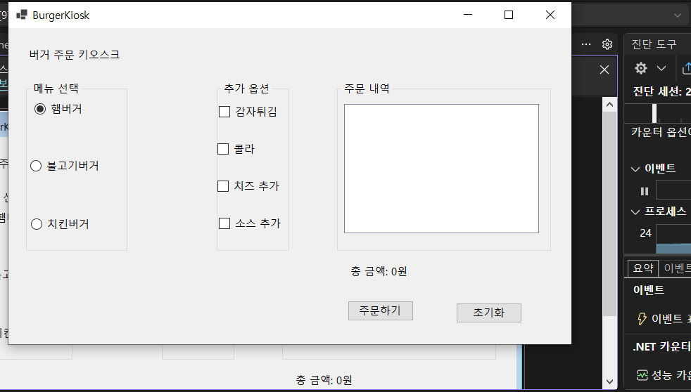
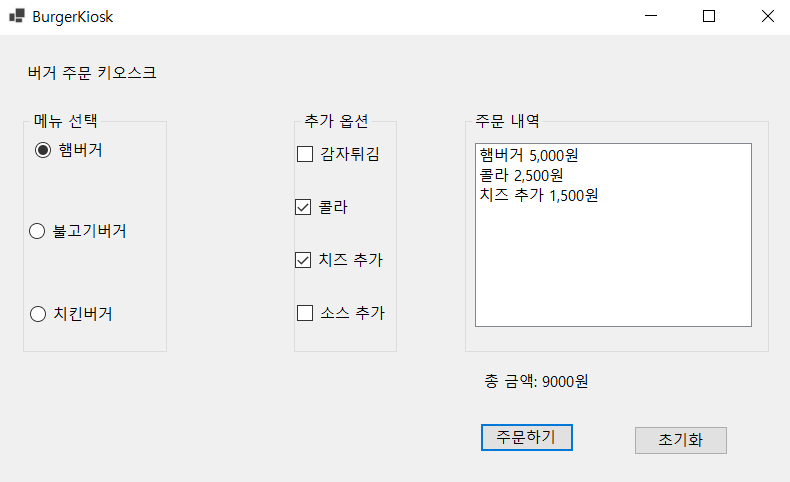
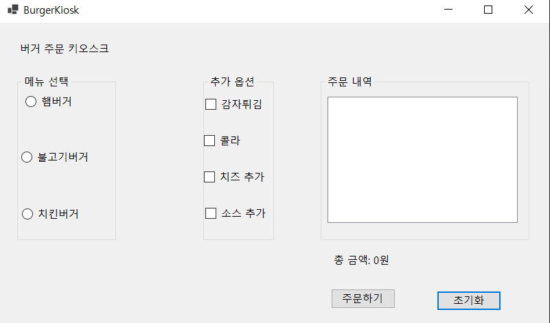
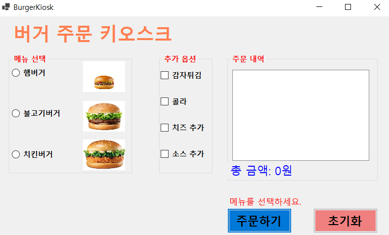
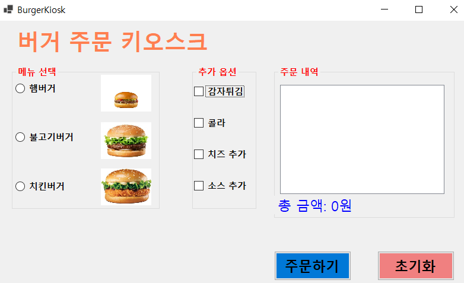
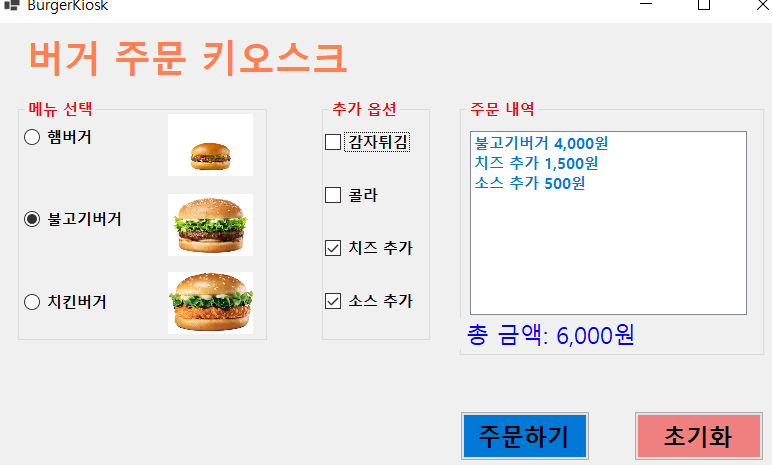

# (C# 코딩) Burger Kiosk

## 개요
- C# 프로그래밍 학습
- 1줄 소개: 사용자가 버거 메뉴와 추가 옵션을 선택해서 주문 내역과 총 금액을 확인하는 프로그램
- 사용한 플랫폼:
- C#, .NET Windows Forms, Visual Studio, GitHub
- 사용한 컨트롤:
- Label, GroupBox, RadioButton, CheckBox, ListBox, Button, PictureBox
- 사용한 기술과 구현한 기능:
- RadioButton을 이용한 버거 메뉴 단일 선택 기능 구현
- CheckBox를 이용한 추가 옵션 다중 선택 기능 구현
- Button 클릭 이벤트로 주문 처리와 초기화 기능 구현
- ListBox를 이용한 주문 내역 출력
- ToString("N0")을 사용하여 총 금액에 세 자리마다 쉼표가 표시되도록 구현
- 메뉴를 선택하지 않았을 때 화면에 안내 문구를 출력하도록 예외 처리 구현
- CheckedChanged 이벤트를 이용하여 메뉴와 옵션 선택 즉시 주문 내역과 총 금액이 갱신되도록 구현

## 실행 화면 (과제1)
- 코드의 실행 스크린샷과 구현 내용 설명

- 구현한 내용 (위 그림 참조)
- UI 구성 : Label(앱 이름 표시), GroupBox 3개(메뉴 선택, 추가 옵션, 주문 내역)
- 메뉴 선택 : RadioButton으로 햄버거 / 불고기버거 / 치킨버거 중 1개 선택
- 추가 옵션 선택 : CheckBox로 감자튀김 / 콜라 / 치즈 추가 / 소스 추가 선택
- 주문 버튼과 초기화 버튼 배치

- 구현한 내용 (위 그림 참조)
- 주문하기 버튼 클릭 시 선택한 메뉴와 옵션을 ListBox에 출력
- 선택한 항목들의 가격을 계산해서 총 금액을 Label에 표시
- 메뉴는 1개만 선택되고 옵션은 여러 개 선택되도록 구현

- 구현한 내용 (위 그림 참조)
- 초기화 버튼 클릭 시 RadioButton과 CheckBox 선택 해제
- ListBox 주문 내역 삭제
- 총 금액 Label을 초기 상태로 되돌리기

## 실행 화면 (과제2)
코드의 실행 스크린샷과 구현 내용 설명

- 구현한 내용 (위 그림 참조)
- 아무 메뉴도 선택하지 않고 주문하기 버튼을 누르면 화면에 에러 메시지가 표시되도록 구현
- MessageBox 대신 Label을 사용해 구현
- 메뉴를 선택한 뒤 다시 주문하면 에러 메시지가 사라지고 정상적으로 주문 내역과 총 금액이 표시되도록 구현

## 실행 화면 (과제3)
코드의 실행 스크린샷과 구현 내용 설명

- 구현한 내용 (위 그림 참조)
- Tab 키를 이용해서 메뉴 선택 영역, 추가 옵션 영역, 버튼 영역으로 이동할 수 있도록 설정
- 방향키를 이용해서 RadioButton 항목 사이를 이동할 수 있도록 구성
- Space 키를 이용해서 CheckBox를 선택할 수 있도록 구현
- Enter 키를 누르면 주문하기 버튼이 실행되도록 설정

## 실행 화면 (과제4)
코드의 실행 스크린샷과 구현 내용 설명

- 구현한 내용 (위 그림 참조)
- RadioButton과 CheckBox를 선택하는 즉시 주문 내역이 ListBox에 바로 표시되도록 구현
- 선택이 바뀔 때마다 총 금액이 다시 계산되어 Label에 즉시 반영되도록 구현